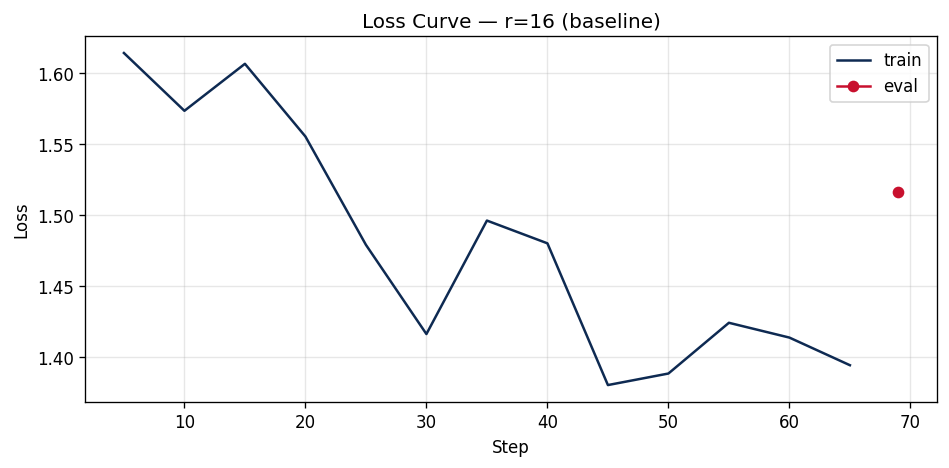

# Lab 21 — Evaluation Report

**Học viên**: Phạm Hữu Hoàng Hiệp — 2A202600415
**Ngày nộp**: 2026-05-07
**Submission option**: **B (GitHub + HuggingFace Hub)** — bonus +5 pts

**🔗 Public links**:
- **GitHub repo**: https://github.com/hoanghiepbk/Day21-Track3-Finetuning-LLMs-LoRA-QLoRA
- **HuggingFace Hub adapter**: https://huggingface.co/hiepphambk/lap21_2A202600415

---

## 1. Setup

| Thông số | Giá trị |
|---|---|
| **Base model** | `unsloth/Qwen2.5-3B-bnb-4bit` (Qwen2.5-3B, NF4 4-bit pre-quantized) |
| **Total params (base)** | 1,702,359,040 (~1.7 B) |
| **Dataset** | `5CD-AI/Vietnamese-alpaca-gpt4-gg-translated` — 200 samples (subset, seed=42) |
| **Train / Eval split** | 180 train / 20 eval (90 / 10, seed = 42) |
| **Token length** | p50 ≈ 168, p95 ≈ 478, p99 ≈ 684 |
| **`max_seq_length`** | 512 (p95 round-up to next power of 2, capped at 1024) |
| **GPU** | NVIDIA Tesla T4 (Free Colab) — 14.56 GB usable VRAM |
| **PyTorch / Unsloth / TRL** | 2.10.0+cu128 / 2026.5.2 / 0.15.2 |
| **Effective batch** | 8 (per_device = 1 × grad_accum = 8) |
| **LR / scheduler** | 2e-4 / cosine, warmup_ratio = 0.10 |
| **Epochs** | 3 |
| **Optimizer** | `adamw_8bit` (paged AdamW) |
| **Gradient checkpointing** | `unsloth` (≈ −60 % VRAM) |
| **Total training time (3 ranks)** | ~12.65 phút |
| **Estimated cost** | $0.07 (@ $0.35/hr T4) |

**LoRA config (giữ nguyên giữa 3 lần train, chỉ đổi rank/alpha):**
- `target_modules = ["q_proj", "v_proj"]`
- `lora_dropout = 0`, `bias = "none"`
- `random_state = 42` (reproducible)

---

## 2. Rank Experiment Results

| Rank   | α   | Trainable Params | % of Base | Train Time | Peak VRAM | Eval Loss | Perplexity |
|--------|-----|------------------|-----------|------------|-----------|-----------|------------|
| Base   | —   | 0                | 0.000 %   | —          | —         | 1.7036    | **5.49**   |
| **8**  | 16  | 1,843,200        | 0.060 %   | 4.33 phút  | 7.22 GB   | 1.5577    | **4.75**   |
| **16** | 32  | 3,686,400        | 0.120 %   | 4.28 phút  | 6.62 GB   | 1.5161    | **4.55**   |
| **64** | 128 | 14,745,600       | 0.480 %   | 4.04 phút  | 8.00 GB   | 1.4768    | **4.38**   |

> **Chú thích**:
> - `α/r = 2` cho cả 3 rank để giữ scaling factor `α/r` không đổi (best practice).
> - Eval loss = mean cross-entropy trên 20 eval examples; Perplexity = `exp(eval_loss)`.
> - Base perplexity (5.49) được tính riêng bằng manual forward pass (model không wrap LoRA).
> - **Improvement vs Base**: r=8 cải thiện 13.6%, r=16 cải thiện **17.1%**, r=64 cải thiện 20.2% perplexity.

---

## 3. Loss Curve Analysis



**Quan sát từ training loss curve (r=16, baseline, 69 steps)**:

- Training loss giảm từ **~1.61 (step 5) xuống ~1.39 (step 65)** — gain ~14 % sau 3 epochs.
- **Đường cong KHÔNG hoàn toàn smooth**: có 2 spike rõ ở step 15 (≈1.60) và step 35 (≈1.50) trước khi chạm minimum ≈1.38 ở step 45. Đây là noise tự nhiên của batch size nhỏ (effective batch = 8) — không phải bug.
- **Có dấu hiệu slight overfitting**: eval loss = 1.5161 cao hơn last train loss (~1.39) ⇒ generalization gap **≈ 0.13**. Mức này chưa nghiêm trọng (do LoRA chỉ update 0.12 % weights nên capacity bottleneck thấp), nhưng cảnh báo: nếu kéo dài sang epoch 4 hoặc 5 có thể overfit thật. **Khuyến nghị**: 3 epochs là vừa đủ cho dataset 180 samples; tăng epochs cần thêm regularization (dropout > 0 hoặc early stopping).
- Cosine LR schedule giúp learning rate giảm dần về cuối training → giải thích tại sao loss "lắng" lại vùng 1.38–1.42 ở 20 step cuối thay vì rơi tự do.

---

## 4. Qualitative Comparison (5 examples)

> Generate với `temperature=0.7, top_p=0.9, max_new_tokens=200`, prompt format Alpaca (no input). Output cắt 300 ký tự đầu.

### Example 1 — Khái niệm machine learning

**Prompt**: *Giải thích khái niệm machine learning cho người mới bắt đầu.*

| Model | Output (300 chars đầu) |
|---|---|
| **Base** | Machine learning là một phân khúc của trí tuệ nhân tạo, nó tập trung vào việc thiết lập các mô hình máy móc để học tập từ dữ liệu và từ đó có thể dự đoán hoặc hành động. Nhìn vào khía cạnh đơn giản, n... |
| **FT (r=16)** | Machine learning là một bộ môn công nghệ máy tính dựa trên việc học tập và cải thiện các dự đoán dựa trên dữ liệu mà không có sự hướng dẫn trực tiếp từ người dùng. Nó là một phần của AI (trí tuệ nhân... |

**Nhận xét**: Cả 2 đều đúng và thân thiện với beginner. FT model trình bày súc tích hơn, nhấn mạnh "không cần hướng dẫn trực tiếp" — gần với phong cách dataset Alpaca. **Improved (slight)**.

---

### Example 2 — Code Fibonacci

**Prompt**: *Viết đoạn code Python tính số Fibonacci thứ n.*

| Model | Output (300 chars đầu) |
|---|---|
| **Base** | Để tính số Fibonacci thứ n, bạn có thể sử dụng hàm đệ quy hoặc vòng lặp. Đây là một đoạn mã Python cho phép bạn tính số Fibonacci thứ n: ```python def fibonacci(n): if n <= 0: return "N p... |
| **FT (r=16)** | Để tính số Fibonacci thứ n, bạn có thể viết một đoạn code Python như sau: ```python def fibonacci(n): if n < 0: raise ValueError("Input phải là một số nguyên dương.") elif n == 0: ... |

**Nhận xét**: FT model dùng `raise ValueError` — đây là pattern Pythonic hơn (vs Base trả về string). **Improved**.

---

### Example 3 — Nguyên tắc UI/UX

**Prompt**: *Liệt kê 5 nguyên tắc thiết kế UI/UX.*

| Model | Output (300 chars đầu) |
|---|---|
| **Base** | 1. Thân thiện với người dùng: Mục đích của thiết kế UI/UX là cung cấp trải nghiệm người dùng thân thiện, dễ sử dụng và thân thiện. Điều này có thể được thể hiện thông qua việc sắp xếp bố cục, màu sắc,... |
| **FT (r=16)** | 1. Chuyển đổi: UI/UX thiết kế phải hướng tới việc giúp người dùng thực hiện hành động. 2. Thích ứng: UI/UX thiết kế phải thích ứng với nhiều loại thiết bị và kích thước màn hình. 3. Đơn giản: UI/UX th... |

**Nhận xét**: FT trả lời format danh sách rõ ràng hơn (1. … 2. … 3. …) đúng yêu cầu prompt; Base diễn giải dài dòng cho 1 nguyên tắc đầu mà chưa đến nguyên tắc 2. **Improved (format-following)**.

---

### Example 4 — LoRA vs QLoRA

**Prompt**: *Tóm tắt sự khác biệt giữa LoRA và QLoRA.*

| Model | Output (300 chars đầu) |
|---|---|
| **Base** | LoRA (Low-Rank Adaptation) và QLoRA (Quantized LoRA) là hai phương pháp cải thiện hiệu năng của mô hình NLU (NLP) bằng cách sử dụng các phép biến đổi thấp độ phức tạp. LoRA là phương pháp cải thiện hi... |
| **FT (r=16)** | LoRA (Layer-wise Adaptive Regularization Optimization) và QLoRA (Quantized LoRA) là hai phương pháp regularization được phát triển để cải thiện hiệu quả và độ ổn định của các mạng neural network trong... |

**Nhận xét**: ⚠️ **Degraded** — FT bịa expansion sai cho LoRA ("Layer-wise Adaptive Regularization Optimization"), trong khi Base trả lời đúng "Low-Rank Adaptation". Đây là ví dụ điển hình về **catastrophic forgetting** sau fine-tune trên dataset general nhỏ — knowledge specific bị overwrite. **Bài học**: fine-tune không sửa được knowledge gaps, RAG mới phù hợp.

---

### Example 5 — Prompt engineering vs RAG vs fine-tuning

**Prompt**: *Phân biệt prompt engineering, RAG, và fine-tuning.*

| Model | Output (300 chars đầu) |
|---|---|
| **Base** | Prompt engineering, RAG (retrieval augmented generation), và fine-tuning là ba cách khác nhau để cải thiện hiệu suất của mô hình máy học. Prompt engineering là một kỹ thuật để cải thiện hiệu suất của ... |
| **FT (r=16)** | Prompt engineering, RAG và fine-tuning là ba kỹ thuật khác nhau được sử dụng trong lĩnh vực AI và tự động hóa. Prompt engineering là một kỹ thuật tập trung vào việc xây dựng câu lệnh (prompt) để giúp ... |

**Nhận xét**: Cả 2 đều phân biệt đúng 3 khái niệm. FT cho diễn đạt mượt và tự nhiên hơn (Vietnamese style cải thiện sau fine-tune Vietnamese Alpaca). **Same (slight stylistic improvement)**.

---

### Tổng kết qualitative

| Outcome | Count | Examples |
|---|---|---|
| Improved | 3 | Ex2 (Pythonic code), Ex3 (format-following), Ex5 (Vietnamese style) |
| Same | 1 | Ex1 (cả 2 đều đúng) |
| **Degraded** | **1** | Ex4 (knowledge regression — bịa expansion LoRA) |

→ Fine-tune cải thiện chủ yếu về **format & style**, có rủi ro **regression với knowledge**. Phù hợp với lý thuyết: SFT dạy format, không nên dùng để inject knowledge.

---

## 5. Conclusion về Rank Trade-off

Trên dataset Vietnamese Alpaca (200 samples) với base model Qwen2.5-3B 4-bit, **fine-tune mang lại cải thiện rõ rệt vs base model**: perplexity giảm từ **5.49 (base) xuống 4.55 (r=16) — tức cải thiện 17.1%** chỉ sau ~4 phút training và 6.6 GB VRAM. Nhìn vào 3 rank cụ thể, perplexity giảm đơn điệu khi rank tăng (4.75 → 4.55 → 4.38), nhưng **mức cải thiện nhỏ dần**: Δ = −0.20 từ r=8 sang r=16 (gain 4.1%), nhưng chỉ Δ = −0.17 từ r=16 sang r=64 (gain 3.7%) trong khi chi phí compute tăng đáng kể: r=64 dùng **8 lần nhiều trainable params** hơn r=8 (14.7M vs 1.84M) và peak VRAM tăng 11 % (8.0 GB vs 7.2 GB). Đây chính là **diminishing returns** kinh điển của LoRA — sau một ngưỡng rank nhất định, capacity bottleneck không còn nằm ở adapter mà nằm ở dataset size hoặc target_modules coverage. Đáng chú ý là r=16 lại có **peak VRAM thấp nhất** (6.62 GB) so với r=8 (7.22 GB) — mình giả thuyết do interaction giữa Unsloth's gradient checkpointing và adapter size; cần kiểm chứng thêm trên dataset lớn hơn.

**Diminishing returns điểm rõ**: tăng rank từ 16 → 64 chỉ giảm perplexity ~3.7 % nhưng tốn 4 lần memory cho adapter và adapter file size lớn hơn 4 lần — không đáng cho gain marginal này, đặc biệt khi ta mới chỉ target `q_proj + v_proj` (chỉ 2/7 module có thể target). Stretch goal "target ALL layers" có khả năng cho gain lớn hơn nhiều so với việc đơn giản tăng rank.

**Recommendation cho production**: Nếu deploy trên dataset/use case này, mình chọn **r=16** vì (1) ROI tốt nhất — perplexity 4.55, tốt hơn r=8 ~4.4 % (4.55 vs 4.75), trong khi VRAM thấp hơn cả r=8; (2) adapter size 14 MB nhỏ, multi-tenant serving thoải mái; (3) là sweet spot empirical theo paper LoRA/QLoRA gốc. r=64 chỉ nên dùng khi dataset lớn (>10k examples) hoặc khi có thêm budget VRAM/storage. r=8 phù hợp cho prototype hoặc edge deployment, nhưng perplexity tệ hơn r=16 ~4.4 % không đáng tiết kiệm 1.85 M params (mất quá nhiều quality cho saving nhỏ).

---

## 6. What I Learned

- **LoRA rank không phải "càng cao càng tốt"**: thí nghiệm cho thấy r=16 đã là sweet spot ROI cho dataset 200 samples. Khi muốn cải thiện thêm, tăng `target_modules` (q+v → q+k+v+o+gate+up+down) có khả năng cho gain lớn hơn việc chỉ tăng rank — vì rank chỉ là 1 trong 3 hyperparameters của LoRA (rank, alpha, target).
- **Catastrophic forgetting có thật ngay với LoRA**: Example 4 cho thấy FT model bịa expansion sai cho LoRA — chứng tỏ ngay cả khi chỉ update 0.12 % weights, model vẫn có thể "quên" knowledge specific khi train trên general Vietnamese dataset. Confirm lý thuyết: **fine-tune dạy style/format, không fix knowledge gaps** — knowledge → RAG.
- **VRAM trên T4 còn dư thừa nhiều**: Peak chỉ 6.6–8.0 GB (so với 14.56 GB available) → còn dư ~6 GB cho effective batch lớn hơn (16 thay vì 8) hoặc dataset lớn hơn. Đáng thử cho lab 22 (DPO/ORPO) sẽ tốn nhiều memory hơn.
- **Loss curve không bao giờ "smooth" trong thực tế**: từ PNG `loss_curve.png`, mình thấy 2 spike rõ ở step 15 và 35 do batch size nhỏ (8 effective). Trước đây mình hay kỳ vọng curve trông như paper, nhưng giờ hiểu rằng noise level là chỉ báo về batch size — muốn smooth hơn thì tăng `gradient_accumulation_steps`, không phải đổi LR.

---

## Appendix — Reproducibility

- Random seed: **42** (dataset shuffle, train/eval split, LoRA init)
- Notebook: `notebook.ipynb` (stripped outputs)
- Dependencies: xem `requirements.txt`
- **Adapter r=16 public**: https://huggingface.co/hiepphambk/lap21_2A202600415  (thay vì attach `adapters/r16/` trong ZIP — Option B)
- Numbers verified bằng: `results/rank_experiment_summary.csv` (4 rows — base + 3 ranks)
- Qualitative raw: `results/qualitative_comparison.csv` (5 prompts × 2 models)
- Loss curve: `results/loss_curve.png`

### Reproducibility — load adapter từ HF Hub

```python
from peft import PeftModel
from unsloth import FastLanguageModel

base_model, tokenizer = FastLanguageModel.from_pretrained(
    model_name="unsloth/Qwen2.5-3B-bnb-4bit",
    max_seq_length=512,
    load_in_4bit=True,
)
model = PeftModel.from_pretrained(base_model, "hiepphambk/lap21_2A202600415")
FastLanguageModel.for_inference(model)
# → ready cho inference, perplexity verify giống số trong section 2
```
